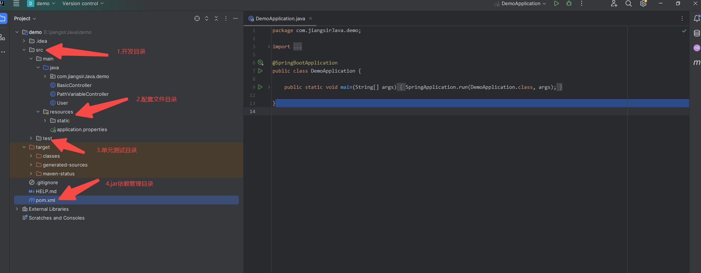
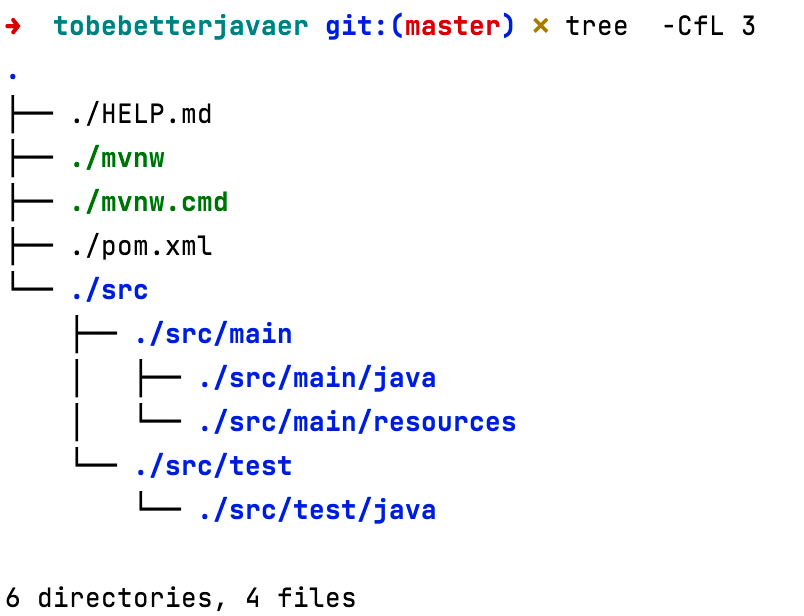

## 关于 Spring Initializr

Spring 官方提供了 Spring Initializr 的方式来创建 Spring Boot 项目。网址如下：

https://start.spring.io/

打开后的界面如下：


你可以将 Spring Initializr 看作是 Spring Boot 项目的初始化向导，它就是用来帮助你在一分钟之内快速搭建一个 Spring Boot 骨架，非常的傻瓜式。

下面我们来解释一下 Spring Initializr 初始化界面中的关键选项。

1）Project：项目的构建方式，可以选择 Maven（安装方式可以戳链接） 和 Gradle（构建脚本基于 Groovy 或者 Kotlin 等语言来编写，而不是传统的 XML）。

2）Language：项目的开发语言，可以选择 Java、Kotlin（JetBrains开发的可以在 JVM 上运行的编程语言）、Groovy（可以作为 Java 平台的脚本语言来使用）。默认 Java 即可。

3）Spring Boot：项目使用的 Spring Boot 版本。默认版本即可，比较稳定。

4）Project Metada：项目的基础设置，包括包名、打包方式、JDK 版本等。

  - Group：项目所属组织的标识符，比如说 top.codingmore；
  - Artifact：项目的标识符，比如说 coding-more；
  - Name：默认保持和 Artifact 一致即可；
  - Description： 项目的描述信息，比如说《编程喵实战项目（Spring Boot+Vue 前后端分离项目）》；
  - Package name：项目包名，根据Group和Artifact自动生成即可。
  - Packaging： 项目打包方式，可以选择 Jar 和 War（SSM 时代，JavaWeb 项目通常会打成 War 包，放在 Tomcat 下），Spring Boot 时代默认 Jar 包即可，因为 Spring Boot 可以内置 Tomcat、Jetty、Undertow 等服务容器了。
Java：项目选用的 JDK 版本，选择 11 或者 8 就行（编程喵采用的是最最最最稳定的 Java8）。
5）Dependencies：项目所需要的依赖和 starter。如果不选择的话，默认只有核心模块 spring-boot-starter 和测试模块 spring-boot-starter-test。

接下来我们带大家使用 Spring Initializr 初始化一个 Web 项目，

- Project 选择 Maven；
- Spring Boot 选择 3.2.0；
- Java 选择 JDK 17；
- Dependencies 选择「Build web, including RESTful, applications using Spring MVC. Uses Apache Tomcat as the default embedded container.」


这预示着我们会采用 SpringMVC 并且使用 Tomcat 作为默认服务器来开发一个 Web 项目。

但是，问题来了，细心的同学可能已经发现了，Spring Initializr只能创建Java 17版本以上的项目了，但我们常用的还是Java 8版本，那么该如何解决呢？

其实也很简单，解决方法有2种：

第一种：使用阿里云的spring初始化脚手架（[传送门](https://start.aliyun.com/)）
他的页面长这个样子，是不是很有阿里味儿


第二种：使用Idea创建时，将server Url的链接地址换成阿里的脚手架即可，比如下面这样


## Spring Boot 项目结构分析
解开压缩包，并导入到 Intellij IDEA 中，可以看到 Spring Boot 项目的目录结构。



可以使用 tree  -CfL 3 命令以树状图列出目录的内容：



- src/main/java 为项目的开发目录，业务代码在这里写。
- src/main/resources 为配置文件目录，静态文件、模板文件和配置文件都放在这里。
- 子目录 static 用于存放静态资源文件，比如说 JS、CSS 图片等。
- 子目录 templates 用于存放模板文件，比如说 thymeleaf 和 freemarker 文件。
- src/test/java 为测试类文件目录。
- pom.xml 用来管理项目的依赖和构建。
## 如何启动/部署 Spring Boot 项目
第一次启动，我个人习惯在 main 类中右键，在弹出的右键菜单这种选择「run ... main()」启动。


经过 2.5s 左右的 build 后，项目启动成功了，可以在日志中看到 Web 项目是以 Tomcat 为容器的，默认端口号为 8080，根路径为空。


这要比传统的 Web 项目省事省心省力，不需要打成 war 包，不需要把 war 包放到 Tomcat 的 webapp 目录下再启动。

那如果想把项目打成 jar 包放到服务器上，以 java -jar xxx.jar 形式运行的话，该怎么做呢？

我们可以打开右边maven的侧边栏的，按照下图操作，即可完成打包


打包完成后，进入 target 目录下，就可以看到打包好的 jar 包了。


利用终端工具 [Tabby](https://github.com/eugeny/tabby?tab=readme-ov-file)，将 jar 包上传到服务器。


执行 java -jar tobebetterjavaer-0.0.1-SNAPSHOT.jar 命令。


可以看到 Spring Boot 项目可以正常在服务器上跑起来了。


至此，第一个Web项目就启动成功了，

我们来测试一下接口请求

```
    @RequestMapping("/hello")
    @ResponseBody
    public String hello(@RequestParam(name = "name", defaultValue = "unknown user") String name) {
        return "Hello " + name;
    }
```
这段代码的业务逻辑非常简单，用户发送 hello 请求，服务器端响应一个“hello, {{name}}”回去。


OK，现在可以访问到了。也就表明我们的第一个 Spring Boot 项目开发完成了。

